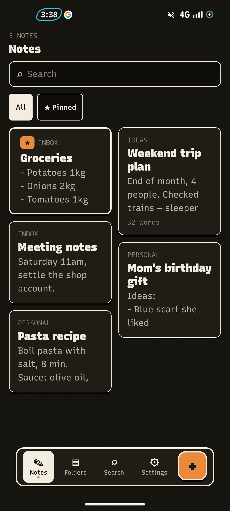
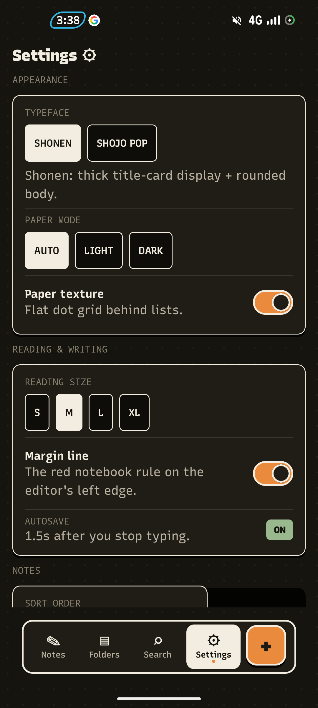
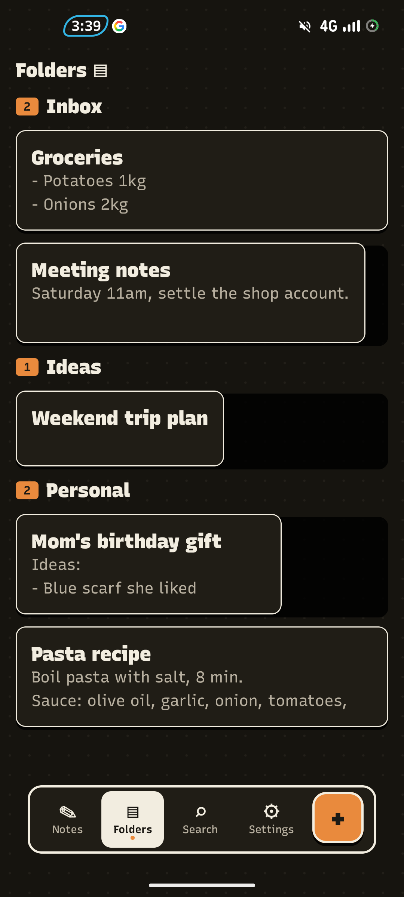

# Genko Notes

Ink-on-paper notes with an anime mood. Offline, private, no ads.

> **Why this exists, honestly:**
> I'm building a novel-writing app and I needed a custom editor for it.
> I didn't want to break the main app while experimenting, so I made this
> separate notes app as a playground.
>
> The editor here is **v1 — not mature yet, but getting there**. Once it's
> solid, I'm porting it straight into the novel app. So if formatting glitches,
> that's exactly what this app is for — catching it early.

> ⚠️ **First version — expect bugs.** If something breaks, open an issue with
> what you did (selected text? tapped toolbar? pasted?) and it'll become a test.

Genko (原稿用紙) is Japanese manuscript paper. That's the whole idea —
notes today, novels tomorrow.

Tap to show/hide screenshots

*Screenshots coming soon — will add after rename.*

<!--

-->

## 💥 Personal DevLog

**v1.0 — first public build**
* Split the editor out of my novel-app work so I can break things safely here
* WYSIWYG is working but young, copy/paste keeps the highlight, autosave is in
* Next: reminders → archive → tag editing → bundled fonts

## 👋 Features

**WRITE LIKE IT'S PAPER**
* True WYSIWYG — no `**` markdown symbols leaking into your text
* Bold / italic / underline / strike / code / marker wash / H1 / H2
* Bullets, checklists, quotes
* Undo / redo (100 steps), word count
* Copy keeps the highlight (styled HTML clipboard, both ways)

**PAPER THAT FEELS LIKE PAPER**
* Light Paper + dark Ink themes, halftone dots, hard ink shadows
* SHONEN / SHOJO type packs — switch the whole mood in Settings
* Reading sizes S / M / L / XL, red margin spine

**NORMAL NOTES STUFF**
* Home grid, Folders, Search, pinning, note covers
* Sort by Updated / Created / A–Z
* Trash + restore + undo toast (30-day auto-purge)
* Share + duplicate notes
* Home-screen widget — 3 recent notes + quick capture
* Autosave every 1.5s + save-on-back (empty notes auto-delete)

**PRIVATE BY DESIGN**
* 100% offline — no internet permission, no account, no tracking
* Notes stored on-device with MMKV, nothing leaves your phone
* 48dp touch targets + TalkBack labels

## 📢 Announcements

* *2026-09-07:* Renamed NijiNotes → **Genko Notes** before release. Same app, better name.

## Install

* **GitHub Releases:** download the APK from [Releases](https://github.com/rgprince/genko-notes/releases) and install
* **F-Droid / IzzyOnDroid:** submitted, waiting — will update here once live

Requires Android 7.0+ (SDK 24), 64-bit device (arm64-v8a / x86_64).

## 💬 Contact

* Open an issue here on GitHub for bugs / ideas — please include steps to reproduce

## ⚠️ License

MIT — do whatever you want, just keep the copyright notice.

See [LICENSE](./LICENSE) for the full text.

## Privacy

No data collection. No network calls. Your notes never leave your device.
